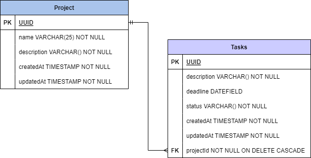

Lestar Herminio
# Desafio - Teste Técnico Esparta

Este é o repositório do desafio proposto pela Esparta para avaliação técnica.

## Sumário
- [Pré-requisitos](#pré-requisitos)
- [Instalação](#instalação)
- [Diagrama ER](#diagrama-er)
- [Documentação API](#documentação-api)
- [Uso Local](#uso-local)
- [Uso Docker](#uso-docker)
- [Testes](#testes)
- [Tecnologias Utilizadas](#tecnologias-utilizadas)
- [Autor](#autor)


## Pré-requisitos
- <a name= 'Node.js' href='https://nodejs.org/en/'>Node.js</a> 14 ou superior;
- <a name= 'Yarn' href='https://yarnpkg.com/'>Yarn</a> ou <a name= 'Npm' href='https://www.npmjs.com/'>NPM</a>; 
- Banco de dados <a name= 'PostgreSQL' href='https://www.postgresql.org/'>PostgreSQL</a>;

## Instalação
1. Faça um clone do repositório:
```bash
git clone https://github.com/lestardeangelo/teste_tecnico_esparta.git
```

2. Acesse o diretório do projeto:
```bash
cd teste_tecnico_esparta
```
3. Instale as dependências do projeto:
```bash
yarn install
```
## Diagrama ER

Diagrama ER da API definindo as relações entre as tabelas do banco de dados.



## Documentação API
<a name= 'Documentação API desafio esparta' href='https://lestardeangelo.github.io/Doc/'>Clique aqui para acessar a doc da API</a>

## Uso Local

1. Configure o banco de dados PostgreSQL, adicionando as informações de acesso no arquivo .env seguindo o modelo do arquivo .env.example.

2. Execute as migrations do banco de dados:
```bash
yarn typeorm migration:run
```
3. Para iniciar o servidor, execute o comando:
```bash
yarn dev
```
4. As rotas podem ser acessadas através do endereço:
```bash
http://localhost:3333
```
5. Para testar as rotas, utilize o software Insomnia ou Postman.

## Uso Docker

1. Execute o comando para construir as imagens e iniciar os containers

```bash
docker-compose up --build
```
2. Acesse o navegador e digite a seguinte URL

```bash
http://localhost:3000/
```

## Testes
Para executar os testes, execute o comando:

```bash
yarn test
```
## Tecnologias Utilizadas

Node.js
- TypeScript
- Express
- TypeORM
- PostgreSQL
- Jest
- Docker

## Autor
Este projeto foi desenvolvido por Lester De Angelo.
